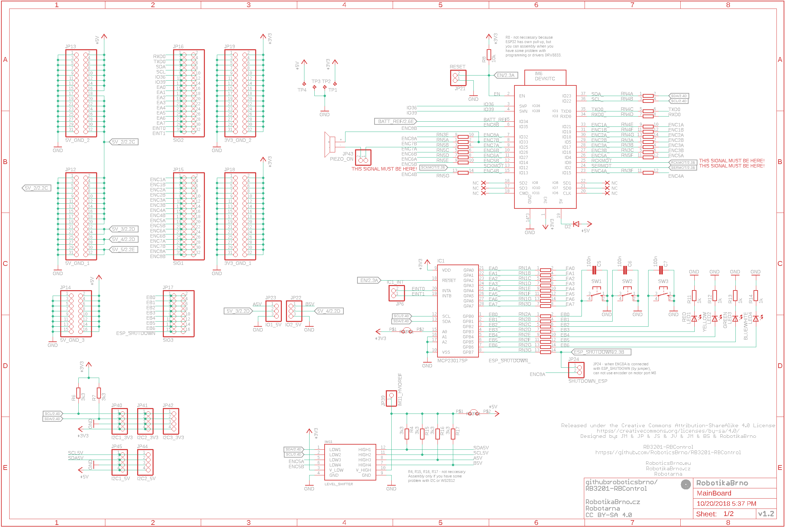
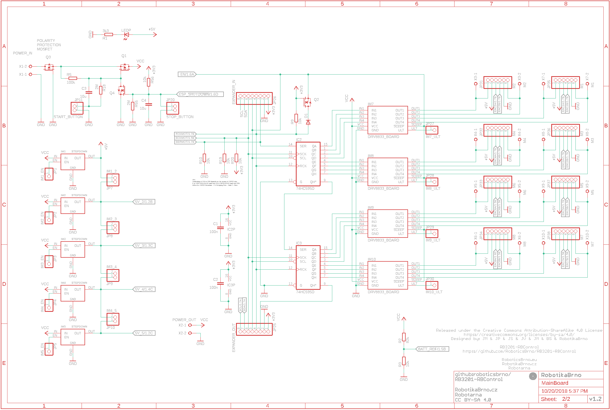
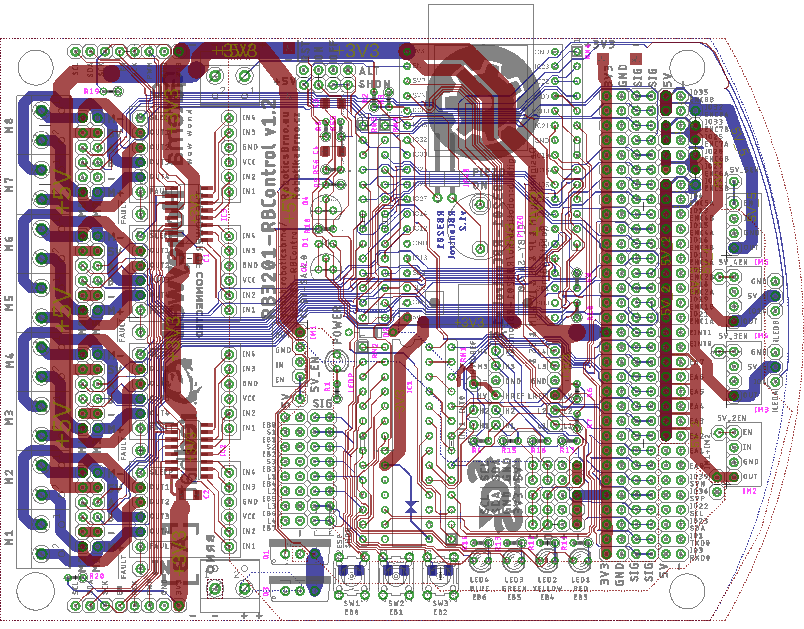
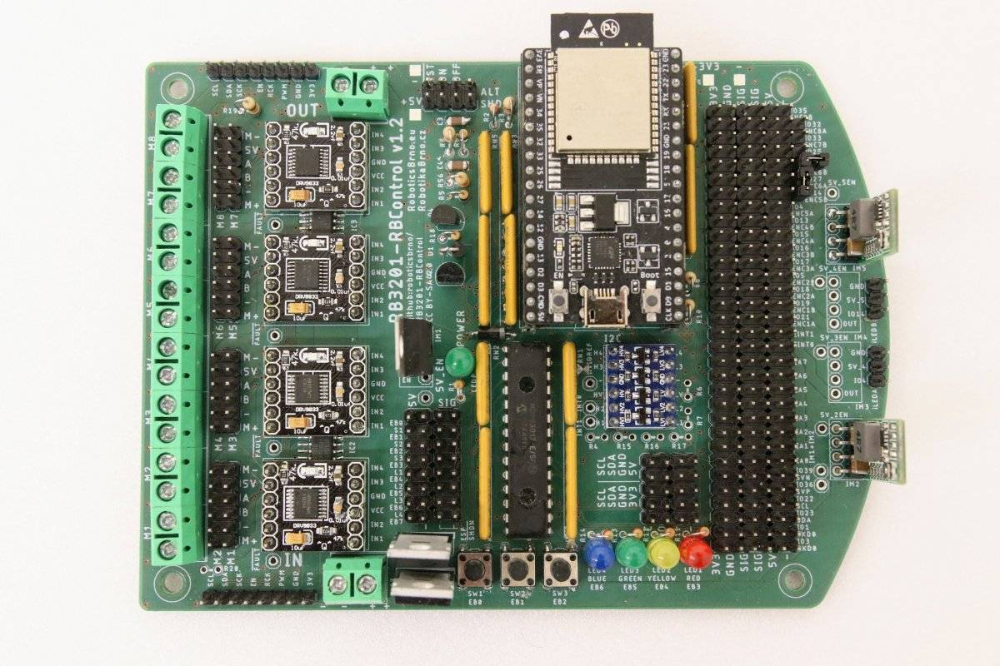
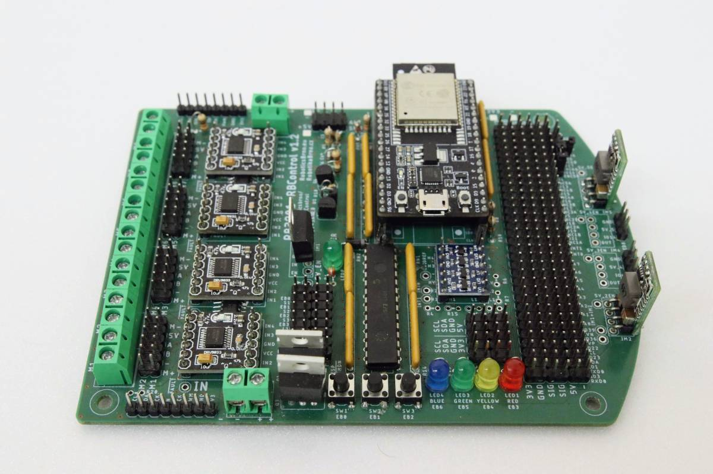

# RB3201-RBControl

[[English version follows]](#english-version)

RB3201-RBControl (RBC) - univerzální deska pro stavbu hobby robotů.

Licence: [CC BY-SA 4.0](https://creativecommons.org/licenses/by-sa/4.0/?)

Arduino knihovna: [RB3201-RBControl-library](https://github.com/RoboticsBrno/RB3201-RBControl-library) ([PlatformIO](https://platformio.org/lib/show/5532/RB3201-RBControl))

Jde v podstatě o shield k vývojovému kitu [ESP32-DevKitC](https://www.espressif.com/en/products/hardware/esp32-devkitc/overview), který má dva hlavní cíle:

- umožnit snadné připojení velkého množství různých periférií (motory s enkodéry, serva, senzory...)
- rozšířit počet pinů desky ESP32 

## Hlavní vlastnosti

- současně ovládat až 8 DC motorů (1,5 A trvale, 2A špičkově každý) a obsluhovat 8 enkodérů pro tyto motory
- po osazení spínanými zdroji napájet a ovládat 4 serva nebo 8 mikroserv
- vyvedená I2C sběrnice - celkem 6x (4x s 3,3 V a 2x s 5 V logickou úrovní)
- expandér pinů, který je připojený přes I2C a obsluhuje další dva porty A,B po 8 pinech (celkem dalších 16 pinů) 
- tři tlačítka, 4 LED a piezo
- připravena ochrana proti přepólování a podvybití

## Rozšiřující moduly

### Motor enkodér

DPS jako enkodér na [upravené levné čínské motory s magnetem](https://mickoflus.cz/guide.html#motor-magnet)

- [Schema](docs/RB3201-RBControl_MotorEncoder_v1.1_schema.png)
- [Board](docs/RB3201-RBControl_MotorEncoder_v1.1_board.png)

### Lego konektor

- [LegoConnectorX1A - Schema](docs/RB3201-RBControl_LegoConnectorX1A_v1.0_schema.png)
- [LegoConnectorX1A - Board](docs/RB3201-RBControl_LegoConnectorX1A_v1.0_board.png)
- [LegoConnectorX1B - Schema](docs/RB3201-RBControl_LegoConnectorX1B_v1.0_schema.png)
- [LegoConnectorX1B - Board](docs/RB3201-RBControl_LegoConnectorX1B_v1.0_board.png)
- [LegoConnectorX2 - Schema](docs/RB3201-RBControl_LegoConnectorX2_v1.0_schema.png)
- [LegoConnectorX2 - Board](docs/RB3201-RBControl_LegoConnectorX2_v1.0_board.png)

# English Version

RB3201-RBControl (RBC) is a universal controller for hobby robots.

License: [CC BY-SA 4.0](https://creativecommons.org/licenses/by-sa/4.0/?)

Arduino library: [RB3201-RBControl-library](https://github.com/RoboticsBrno/RB3201-RBControl-library) ([PlatformIO](https://platformio.org/lib/show/5532/RB3201-RBControl))

The board is a shield for [ESP32-DevKitC](https://www.espressif.com/en/products/hardware/esp32-devkitc/overview) with the following two main functions:

- the board allows connecting a variety of peripherals (DC motors with encoders, RC servo motors, sensors, etc...)
- it expands the ESP32 GPIOs.

## Main Features

- it can control up to 8 DC motors (1.5 A average, 2 A peak for each motor), possibly with an encoder for each motor;
- after populating switching power supplies, it can power and control 4 servo motors or 8 micro servo motors;
- there are I2C headers for connection up to 6 peripherals (4x 3.3V, 2x 5V);
- there is an I2C GPIO expander, which adds two ports (A and B), 8 GPIOs each;
- three push buttons, four LEDs and a piezo buzzer built-in;
- reverse polarity and over-discharge protection.

## Expanding modules

### MotorEncoder

PCB encoder for dirty cheap Chinese DC motors with encoders.

- [Schema](docs/RB3201-RBControl_MotorEncoder_v1.1_schema.png)
- [Board](docs/RB3201-RBControl_MotorEncoder_v1.1_board.png)

### LegoConnector

- [LegoConnectorX1A - Schema](docs/RB3201-RBControl_LegoConnectorX1A_v1.0_schema.png)
- [LegoConnectorX1A - Board](docs/RB3201-RBControl_LegoConnectorX1A_v1.0_board.png)
- [LegoConnectorX1B - Schema](docs/RB3201-RBControl_LegoConnectorX1B_v1.0_schema.png)
- [LegoConnectorX1B - Board](docs/RB3201-RBControl_LegoConnectorX1B_v1.0_board.png)
- [LegoConnectorX2 - Schema](docs/RB3201-RBControl_LegoConnectorX2_v1.0_schema.png)
- [LegoConnectorX2 - Board](docs/RB3201-RBControl_LegoConnectorX2_v1.0_board.png)

## Schema ([PDF](docs/RB3201-RBControl_MainBoard_v1.2_schema.pdf))

Logic

Power

## PCB ([PDF](docs/RB3201-RBControl_MainBoard_v1.2_board.pdf))

## Photos

